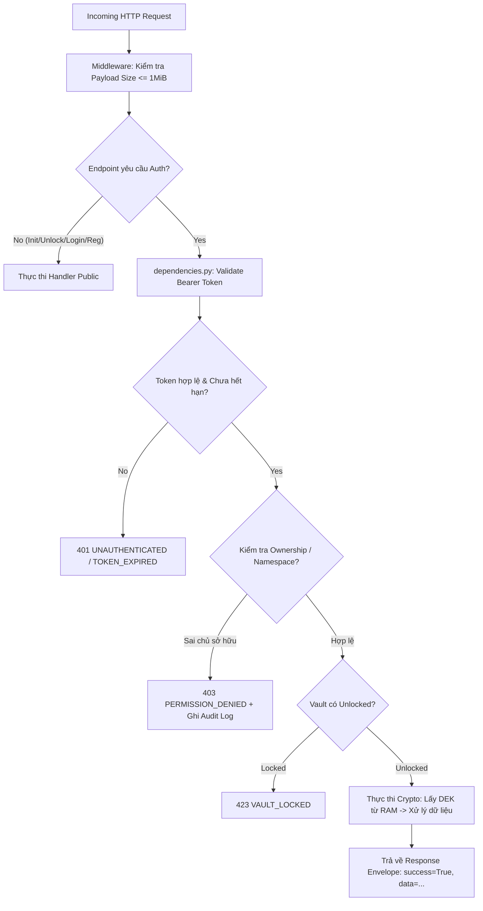

# CẨM NANG TOÀN DIỆN VẤN ĐÁP PROJECT MINI VAULT
> **Dành cho sinh viên bảo vệ môn An Toàn & Mật Mã (Computer Security)**  
> **Phiên bản:** 2.0 (Đầy đủ Lý thuyết, Kiến trúc, Codebase Walkthrough và 50+ Câu hỏi Vấn đáp Thực chiến)

---

## 📌 MỤC LỤC
1. [TỔNG QUAN DỰ ÁN & BÀI TOÁN THỰC TẾ](#1-tổng-quan-dự-án--bài-toán-thực-tế)
2. [KIẾN TRÚC HỆ THỐNG & NGUYÊN TẮC BẢO MẬT BẤT BIẾN](#2-kiến-trúc-hệ-thống--nguyên-tắc-bảo-mật-bất-biến)
3. [MÔ HÌNH PHÂN CẤP KHÓA (KEY HIERARCHY) & VÒNG ĐỜI DEK](#3-mô-hình-phân-cấp-khóa-key-hierarchy--vòng-đời-dek)
4. [BẢN ĐỒ SOURCE CODE & CHI TIẾT TỪNG MODULE](#4-bản-đồ-source-code--chi-tiết-từng-module)
5. [PHÂN TÍCH CHI TIẾT TỪNG TÍNH NĂNG CỐT LÕI & NÂNG CAO](#5-phân-tích-chi-tiết-từng-tính-năng-cốt-lõi--nâng-cao)
6. [CÁC CƠ CHẾ MẬT MÃ HỌC SỬ DỤNG TRONG DỰ ÁN](#6-các-cơ-chế-mật-mã-học-sử-dụng-trong-dự-án)
7. [BỘ CÂU HỎI VẤN ĐÁP THỰC CHIẾN (50+ CÂU HỎI & ĐÁP ÁN CHUYÊN SÂU)](#7-bộ-câu-hỏi-vấn-đáp-thực-chiến-50-câu-hỏi--đáp-án-chuyên-sâu)
   - [Nhóm 1: Lý thuyết Mật mã học (Crypto Fundamentals)](#nhóm-1-lý-thuyết-mật-mã-học-crypto-fundamentals)
   - [Nhóm 2: Thiết kế Hệ thống & Quản lý Trạng thái](#nhóm-2-thiết-kế-hệ-thống--quản-lý-trạng-thái)
   - [Nhóm 3: Xác thực, Phân quyền & Chống tấn công (Defense)](#nhóm-3-xác-thực-phân-quyền--chống-tấn-công-defense)
   - [Nhóm 4: Bắt bẻ Code, Tình huống Oái oăm & Edge Cases](#nhóm-4-bắt-bẻ-code-tình-huống-oái-oăm--edge-cases)
   - [Nhóm 5: So sánh Thực tế (AWS KMS, HashiCorp Vault) & Mở rộng](#nhóm-5-so-sánh-thực-tế-aws-kms-hashicorp-vault--mở-rộng)
8. [KỊCH BẢN DEMO NHANH KHI ĐỨNG TRƯỚC GIẢNG VIÊN](#8-kịch-bản-demo-nhanh-khi-đứng-trước-giảng-viên)
9. [BẢNG TRA CỨU MÃ LỖI VÀ HTTP STATUS CODE](#9-bảng-tra-cứu-mã-lỗi-và-http-status-code)

---

# 1. TỔNG QUAN DỰ ÁN & BÀI TOÁN THỰC TẾ

### 1.1. Mini Vault là gì?
**Mini Vault** là một dịch vụ "Két sắt số" (Secure Vault Service) được xây dựng dưới dạng REST API (FastAPI), mô phỏng lại các cơ chế bảo mật then chốt của các hệ thống công nghiệp như **HashiCorp Vault** và **AWS Key Management Service (KMS)**.

### 1.2. Bài toán thực tế mà Mini Vault giải quyết
Trong phát triển phần mềm, các lập trình viên thường mắc phải 2 sai lầm nghiêm trọng:
1. **Lưu trữ Secrets (Mật khẩu DB, API Key, Token) dưới dạng Plaintext** hoặc nhúng cứng (hardcoded) trong mã nguồn/file cấu hình. Khi mã nguồn bị rò rỉ hoặc file database/backup bị lộ, toàn bộ hệ thống bị xâm nhập.
2. **Quản lý khóa phân tán và thiếu an toàn**: Ứng dụng tự sinh khóa mã hóa rồi lưu khóa ngay cạnh dữ liệu, hoặc gửi khóa qua mạng cho các client.

**Mini Vault giải quyết triệt để 2 vấn đề trên qua 2 Engine cốt lõi:**
* **Engine 1: KV Engine (Secure Storage - Key/Value):**
  Lưu trữ bí mật của người dùng dưới dạng **Ciphertext đã xác thực (Authenticated Ciphertext)** trên đĩa cứng (SQLite). Dữ liệu mã hóa ở trạng thái nghỉ (**Encrypted-at-Rest**). Kẻ tấn công dù trộm được toàn bộ file SQLite cũng chỉ thấy dữ liệu rác không thể giải mã.
* **Engine 2: Transit Engine (Encryption & Signing as a Service):**
  Cung cấp API để các ứng dụng khác gửi dữ liệu lên server nhờ **mã hóa/giải mã (AES-256-GCM)** hoặc **ký số/xác minh chữ ký (Ed25519)**. **Khóa mã hóa và khóa riêng (Private Key) không bao giờ rời khỏi server**, client không bao giờ được chạm vào key material.

### 1.3. Bảng tóm tắt Công nghệ (Tech Stack)

| Thành phần | Công nghệ / Thư viện | Mục đích sử dụng |
|---|---|---|
| **Web Framework** | `FastAPI` + `Uvicorn` | Xây dựng REST API hiệu năng cao, tự động sinh tài liệu Swagger/OpenAPI |
| **Data Validation** | `Pydantic` | Kiểm tra tính hợp lệ và cấu trúc dữ liệu đầu vào nghiêm ngặt |
| **Database & ORM** | `SQLite` + `SQLAlchemy` | Lưu trữ bền vững dữ liệu cấu hình, tài khoản, ciphertext |
| **Mật mã đối xứng (AEAD)** | `cryptography.hazmat (AESGCM)` | Mã hóa AES-256-GCM (bảo vệ bí mật và toàn vẹn dữ liệu) |
| **Chữ ký số (Asymmetric)** | `cryptography.hazmat (Ed25519)` | Ký số tốc độ cao, kích thước chữ ký nhỏ và an toàn chống tấn công |
| **Băm mật khẩu & KDF** | `argon2-cffi` | Băm mật khẩu người dùng và dẫn xuất khóa (KDF) kháng GPU brute-force |
| **Sinh ngẫu nhiên an toàn** | `secrets`, `os.urandom` | Sinh Token 256-bit entropy, Salt ngẫu nhiên, Nonce 12-byte, AES key 32-byte |
| **Kiểm thử tự động** | `pytest` | Chạy 15 bộ test phủ toàn bộ 8 yêu cầu bắt buộc và các ca lỗi biên |
| **Đóng gói** | `Docker` + `docker-compose` | Chạy container hóa với user non-root và volume lưu trữ cách ly |

---

# 2. KIẾN TRÚC HỆ THỐNG & NGUYÊN TẮC BẢO MẬT BẤT BIẾN

### 2.1. Kiến trúc phân lớp (Layered Architecture)

```text
                  ┌────────────────────────────────────────┐
                  │                 CLIENT                 │
                  │  (Web Browser / Mobile App / Microservice)
                  └───────────────────┬────────────────────┘
                                      │ HTTP REST API (Bearer Token)
                                      ▼
                  ┌────────────────────────────────────────┐
                  │           FASTAPI APPLICATION          │
                  │  (app/main.py, middleware, router.py)  │
                  └─────┬──────────────┬──────────────┬────┘
                        │              │              │
        ┌───────────────▼┐      ┌──────▼───────┐    ┌─▼──────────────────┐
        │ Authentication │      │  Vault Core  │    │      Engines       │
        │  (app/auth/)   │      │ (app/core/)  │    │  (app/kv, transit) │
        └───────┬────────┘      └──────┬───────┘    └─┬──────────────────┘
                │                      │              │
                │               ┌──────▼───────┐      │
                │               │  VaultState  │◄─────┘ (Truy xuất DEK)
                │               │  (Chỉ ở RAM) │
                │               └──────────────┘
                │                      │
                ▼                      ▼
        ┌────────────────────────────────────────────────────────┐
        │                   STORAGE LAYER                        │
        │       SQLAlchemy ORM + SQLite (data/mini_vault.db)     │
        └────────────────────────────────────────────────────────┘
```

### 2.2. Các nguyên tắc bảo mật bất biến (Non-negotiable Security Invariants)

1. **Khởi động luôn ở trạng thái Locked (Mặc định khóa):** Sau mỗi lần restart process hoặc server, Vault luôn ở trạng thái `locked`. Mọi request đến KV Engine và Transit Engine bắt buộc bị từ chối với mã lỗi `423 VAULT_LOCKED`.
2. **Không bao giờ lưu Plaintext DEK xuống đĩa:** Khóa mã hóa dữ liệu (DEK) chỉ tồn tại trong bộ nhớ RAM (`VaultState`). Trên đĩa chỉ lưu bản bọc (Encrypted DEK) bằng khóa dẫn xuất từ Master Passphrase.
3. **Không rò rỉ Key Material qua API:** Không có bất kỳ endpoint nào trả về DEK, Named AES key hay Private Signing Key dưới dạng plaintext hay base64.
4. **Xác thực trước (Authentication First):** Mọi endpoint nghiệp vụ (trừ Register/Login/Init/Unlock/Status) đều bắt buộc có Bearer Token hợp lệ và chưa hết hạn.
5. **Kiểm tra quyền trước khi thao tác (Authorization Before Crypto):** Quyền sở hữu (Ownership) được kiểm tra trước khi hệ thống thực hiện bất kỳ thao tác giải mã hay truy xuất database nào.
6. **Mã hóa có xác thực (AEAD - AES-256-GCM):** Tuyệt đối không dùng các mode mã hóa không an toàn (như ECB, CBC không kèm MAC). Nonce phải ngẫu nhiên và duy nhất cho mỗi lần mã hóa.
7. **Bảo vệ mật khẩu một chiều:** Mật khẩu người dùng được băm bằng Argon2id. Tuyệt đối cấm dùng MD5, SHA-1, SHA-256 trơn.
8. **Chống dò mật khẩu (Account Lockout):** 5 lần đăng nhập sai liên tiếp sẽ khóa tài khoản chính xác trong 5 phút.

---

# 3. MÔ HÌNH PHÂN CẤP KHÓA (KEY HIERARCHY) & VÒNG ĐỜI DEK

Đây là một trong những câu hỏi **"kinh điển"** mà giảng viên sẽ hỏi khi vấn đáp. Hãy nắm vững sơ đồ phân cấp 3 tầng sau:

```mermaid
graph TD
    A["Master Passphrase (Do Admin nhập, KHÔNG BAO GIỜ LƯU)"] -->|Argon2id + 16B Salt ngẫu nhiên| B["Derived Key (Khóa dẫn xuất - Chỉ ở RAM lúc init/unlock)"]
    B -->|AES-256-GCM Key Wrapping (AAD: mini-vault-dek-v1)| C["Encrypted DEK (Lưu trên SQLite DB)"]
    
    C -.->|Giải mã bằng Derived Key khi Unlock| D["Plaintext DEK (32-byte AES Key - CHỈ NẰM TRONG RAM)"]
    
    D -->|AES-256-GCM (AAD: path)| E["KV Secrets (Dữ liệu JSON của User)"]
    D -->|AES-256-GCM (AAD: key:email:name)| F["Transit Named AES Keys (32-byte)"]
    D -->|AES-256-GCM (AAD: key:email:name)| G["Transit Ed25519 Private Keys"]
    
    F -->|AES-256-GCM (AAD: transit:email:name:vN)| H["Client Payload Data (Transit Encrypt/Decrypt)"]
    G -->|PureEdDSA Sign| I["Digital Signatures (Transit Sign)"]
```

### Vòng đời của DEK (DEK Lifecycle):
1. **Lúc Init (`/vault/init`):**
   - Sinh Salt ngẫu nhiên 16 byte, sinh DEK ngẫu nhiên 32 byte (`os.urandom(32)`).
   - Dùng Argon2id biến `Master Passphrase + Salt` thành `Derived Key` (32 byte).
   - Dùng `Derived Key` mã hóa `DEK` bằng AES-256-GCM với AAD `mini-vault-dek-v1`.
   - Lưu Salt, tham số KDF, Nonce và Encrypted DEK vào bảng `vault_config`.
   - Trạng thái hệ thống vẫn là `locked`. Plaintext DEK bị hủy khỏi RAM.
2. **Lúc Unlock (`/vault/unlock`):**
   - Đọc Salt và tham số KDF từ DB, kết hợp với Passphrase người dùng vừa nhập để tái tạo `Derived Key`.
   - Dùng `Derived Key` giải mã Encrypted DEK. Nếu Passphrase sai -> GCM tag mismatch -> từ chối (401).
   - Nếu đúng -> Nạp Plaintext DEK vào singleton `vault_state` trong RAM. Trạng thái -> `unlocked`.
3. **Lúc Lock (`/vault/lock` hoặc Server Restart):**
   - Đặt biến `self._dek = None` trong `VaultState`.
   - Trạng thái -> `locked`. Không còn DEK trong RAM để giải mã dữ liệu.

---

# 4. BẢN ĐỒ SOURCE CODE & CHI TIẾT TỪNG MODULE

```text
app/
├── main.py                  # Khởi tạo FastAPI, middleware giới hạn payload, lifespan event
├── config.py                # Cấu hình hệ thống (Pydantic Settings: DB_PATH, SESSION_TTL, etc.)
├── database.py              # Cấu hình SQLAlchemy Engine, SessionLocal, Base
├── dependencies.py          # Dependency Injection: current_principal (xác thực Bearer Token)
├── exceptions.py            # Custom Exception AppError, exception_handler, hàm bọc response ok()
├── models.py                # Định nghĩa 8 bảng database SQLAlchemy ORM
├── schemas.py               # Pydantic Schemas định nghĩa Request/Response Body
├── router.py                # Định tuyến toàn bộ API dưới prefix /api/v1
│
├── core/                    # [VAULT CORE]
│   ├── crypto_service.py    # Hàm mã hóa/giải mã AES-256-GCM cấp thấp
│   ├── key_derivation.py    # Dẫn xuất khóa từ Passphrase bằng Argon2id (KDF)
│   ├── vault_state.py       # Thread-safe in-memory state chứa Plaintext DEK
│   └── vault_service.py     # Nghiệp vụ Init, Unlock, Lock, Status
│
├── auth/                    # [AUTHENTICATION]
│   └── service.py           # Register, Login (Lockout 5p sau 5 lần sai), Logout, Token Digest
│
├── kv/                      # [FEATURE 1: KV ENGINE]
│   └── service.py           # CRUD Secret mã hóa bằng DEK, KV Versioning, Namespace validation
│
├── transit/                 # [FEATURE 2: TRANSIT ENGINE]
│   └── service.py           # Tạo Named Key, Encrypt, Decrypt, Sign, Verify, Key Rotation, Revoke
│
├── audit/                   # [AUDIT LOGGING]
│   └── service.py           # Ghi nhật ký truy cập trái phép (DENIED), IP, Actor, Resource
│
└── utils/                   # [UTILITIES]
    ├── base64_utils.py      # Encode/Decode Base64 nghiêm ngặt (Strict Validation)
    ├── datetime_utils.py    # Hàm utcnow() chuẩn hóa thời gian UTC
    └── validation.py        # Kiểm tra độ mạnh Passphrase, Whitelist Key Name & Path
```

### Các bảng Cơ sở Dữ liệu (`app/models.py`):
1. `vault_config`: Lưu cấu hình Vault (Salt KDF, Params KDF, Encrypted DEK, DEK Nonce).
2. `users`: Lưu thông tin tài khoản (`email`, `password_hash` Argon2id, `failed_login_attempts`, `locked_until`).
3. `sessions`: Lưu phiên đăng nhập (`token_hash` SHA-256, `expires_at`, `revoked_at`).
4. `kv_secrets`: Lưu secret hiện tại (`path`, `owner_email`, `nonce_b64`, `ciphertext_b64`).
5. `kv_secret_versions`: Lưu lịch sử phiên bản của từng KV secret (`kv_secret_id`, `version`, `ciphertext_b64`).
6. `transit_keys`: Lưu metadata named key (`key_name`, `owner_email`, `key_usage`, `algorithm`, `encrypted_key_material_b64`, `public_key_b64`, `revoked_at`).
7. `transit_key_versions`: Lưu lịch sử các version khóa AES phục vụ Key Rotation.
8. `audit_logs`: Lưu nhật ký kiểm toán (`actor_email`, `action`, `resource_type`, `resource_identifier`, `result`, `ip_address`).

---

# 5. PHÂN TÍCH CHI TIẾT TỪNG TÍNH NĂNG CỐT LÕI & NÂNG CAO



### 5.1. Feature 0.1 — Khởi tạo và Mở khóa Vault (Master Passphrase)
* **Quy tắc:** Bắt buộc nhập 2 lần Master Passphrase giống nhau, độ dài >= 12 ký tự, đủ chữ hoa, thường, số, ký tự đặc biệt.
* **Chống rò rỉ:** Khi nhập sai Master Passphrase lúc `/unlock`, hệ thống bắt ngoại lệ `InvalidTag` từ AES-GCM và trả về lỗi chung `401 INVALID_MASTER_PASSPHRASE` mà không hé lộ chi tiết kỹ thuật.
* **Bộ nhớ RAM:** Sử dụng `threading.RLock()` bảo vệ biến `_dek` trong `VaultState`, đảm bảo an toàn đa luồng (thread-safe).

### 5.2. Feature 0.2 — Đăng ký, Đăng nhập, Quản lý Session & Khóa tài khoản
* **Băm mật khẩu:** Dùng thư viện `argon2-cffi` với cấu hình: `time_cost=3, memory_cost=65536 (64MB), parallelism=2`.
* **Cơ chế cấp Token:** Sinh chuỗi ngẫu nhiên bằng `secrets.token_urlsafe(32)` (256-bit entropy).
* **Bảo vệ Token trong DB:** Database **không bao giờ lưu Token thô**, chỉ lưu giá trị băm SHA-256 (`token_digest`). Khi xác thực, băm token gửi lên rồi so sánh bằng hàm `secrets.compare_digest` để **chống tấn công đo thời gian (Timing Attack)**.
* **Cơ chế Khóa 5 phút (Account Lockout):**
  - Đếm số lần sai liên tiếp trong cột `failed_login_attempts`.
  - Đạt 5 lần -> gán `locked_until = now + 5 phút`.
  - Trong thời gian bị khóa, dù nhập đúng mật khẩu vẫn bị từ chối với mã lỗi `423 ACCOUNT_LOCKED`.
  - Khi hết 5 phút: Hệ thống tự động reset bộ đếm về 0 (đòi hỏi phải sai 5 lần liên tiếp mới khóa lại).

### 5.3. Feature 1.1 & 1.2 — KV Engine (Secure Storage & Ownership)
* **Định dạng đường dẫn (Namespace):** Bắt buộc có dạng `secret/<email_người_dùng>/<tên_secret>`.
* **Quy trình Ghi (`PUT /api/v1/kv/{path}`):**
  1. Validate path chống Path Traversal (`..`, `\`, NUL byte) và kiểm tra đúng namespace của caller.
  2. Lấy DEK từ RAM. Serialize JSON thành bytes (sắp xếp key để chuẩn hóa).
  3. Mã hóa bằng AES-256-GCM với `nonce` mới 12-byte, gắn **AAD là chính `path`**.
  4. Lưu bản mã vào bảng `kv_secrets` và tạo bản ghi mới trong `kv_secret_versions` (hỗ trợ KV Versioning).
* **Quy trình Đọc (`GET /api/v1/kv/{path}`):**
  - Giải mã ciphertext bằng DEK với AAD là `path`.
  - Nếu ciphertext hoặc authentication tag bị sửa đổi dù chỉ **1 bit** -> `InvalidTag` -> trả về `400 DECRYPTION_FAILED`, tuyệt đối không trả dữ liệu rác.
* **Kiểm soát truy cập (Access Control):**
  - Nếu Alice cố tình đọc `secret/bob@example.com/...`, hệ thống từ chối ngay lập tức với `403 PERMISSION_DENIED`.
  - Lỗi trả về đồng nhất giữa "không có quyền" và "path không tồn tại" -> **chống kỹ thuật dò quét tài nguyên (Resource Enumeration / Probing)**.
  - Ghi nhận hành vi truy cập trái phép vào bảng `audit_logs`.

### 5.4. Feature 2.1, 2.2, 2.3 — Transit Engine (Encryption as a Service & Key Rotation)
* **Phân loại KeyUsage (Mô phỏng AWS KMS):**
  - `ENCRYPT_DECRYPT`: Dành cho khóa đối xứng AES-256.
  - `SIGN_VERIFY`: Dành cho cặp khóa bất đối xứng Ed25519.
  - Nếu dùng nhầm mục đích (ví dụ gọi encrypt bằng signing key) -> báo lỗi `400 INVALID_KEY_USAGE`.
* **Định dạng Ciphertext Tự mô tả (Self-describing Ciphertext):**
  - `vault:v<version>:<key_name>:<Base64(Nonce 12B || Ciphertext || GCM_Tag 16B)>`
  - Client không cần nhớ đã dùng key nào hay version nào, hệ thống tự parse từ chuỗi ciphertext.
  - **Context Binding:** AAD khi mã hóa được gán chặt vào `transit:<email>:<key_name>:v<version>`, ngăn chặn kẻ tấn công hoán đổi bản mã giữa các key hoặc các user khác nhau.
* **Xoay khóa (Key Rotation - Tính năng nâng cao):**
  - Gọi `POST /transit/keys/{name}/rotate`: Hệ thống sinh khóa AES mới, tăng version lên N+1, lưu version mới vào `transit_key_versions`.
  - Dữ liệu mới sẽ được mã hóa bằng version N+1.
  - Dữ liệu cũ (ví dụ `vault:v1:...`) **vẫn giải mã được bình thường** vì hệ thống tra cứu lại key material của version 1 tương ứng trong DB.
* **Thu hồi khóa (Soft Revoke):**
  - Đánh dấu `revoked_at`. Mọi thao tác encrypt, decrypt, rotate sau đó đều bị từ chối với `404 KEY_NOT_FOUND`.

### 5.5. Feature 2.4 — Sign & Verify as a Service (Ed25519)
* **Sinh khóa:** Sinh cặp khóa Ed25519. Khóa riêng (Private Key 32-byte) được bọc bằng DEK trước khi lưu DB. Khóa công khai (Public Key 32-byte) lưu dạng plaintext (vì không cần giữ bí mật).
* **Cơ chế Ký (`POST /transit/sign`):**
  - Hỗ trợ 2 chế độ `message_type`:
    - `RAW`: Ký trực tiếp trên dữ liệu gốc (PureEdDSA sử dụng SHA-512 nội bộ).
    - `DIGEST`: Nhận hash SHA-256 tính sẵn từ client (bắt buộc đúng 32 byte).
* **Cơ chế Xác minh (`POST /transit/verify`):**
  - Dùng Public Key để kiểm tra chữ ký.
  - Trả về cấu trúc JSON: `{"key_name": "...", "signature_valid": true/false, "signing_algorithm": "ED25519"}`.
  - Khi chữ ký sai hoặc message bị sửa đổi, trả `signature_valid: false` thay vì quăng lỗi crash ứng dụng.
  - Kiểm tra thuật toán: Nếu client gửi `signing_algorithm` không khớp (ví dụ gửi RSA) -> trả `400 INVALID_SIGNING_ALGORITHM`.

---

# 6. CÁC CƠ CHẾ MẬT MÃ HỌC SỬ DỤNG TRONG DỰ ÁN

| Khái niệm mật mã | Triển khai trong Mini Vault | Tại sao lại chọn / Giải thích bản chất |
|---|---|---|
| **Argon2id** | KDF cho Passphrase & Băm mật khẩu | Chiến thắng cuộc thi Password Hashing Competition (PHC). Là thuật toán **Memory-hard** (yêu cầu 64MB RAM), kết hợp giữa Argon2d (chống GPU crack) và Argon2i (chống Side-channel attack). |
| **AES-256-GCM** | Mã hóa DEK, KV Secret, Named Key, Data Payload | Thuật toán **AEAD** (Authenticated Encryption with Associated Data). Vừa bảo đảm **Tính bí mật (Confidentiality)** vừa bảo đảm **Tính toàn vẹn (Integrity)** thông qua 16-byte Authentication Tag. |
| **Nonce (12 bytes)** | Sinh bằng `os.urandom(12)` mỗi lần mã hóa | Số dùng một lần (Number used once). Tuyệt đối không tái sử dụng Nonce với cùng một khóa trong GCM mode để tránh lộ khóa và bản rõ. |
| **AAD (Associated Data)** | Gắn `mini-vault-dek-v1`, `path`, hoặc `transit:email:name:vN` | Dữ liệu bổ sung được đưa vào tính toán Authentication Tag nhưng không bị mã hóa. Chống tấn công **Ciphertext Relocation / Context Swapping** (di chuyển bản mã sang path/key khác). |
| **Ed25519 (EdDSA)** | Ký số và xác minh chữ ký | Thuật toán chữ ký số trên đường cong elliptic Curve25519. Nhanh hơn RSA, khóa nhỏ gọn (32-byte), miễn nhiễm với các lỗi sinh số ngẫu nhiên kém (Deterministic Signature). |
| **Key Wrapping** | DEK mã hóa Named Keys & Private Keys | Khóa cấp cao (Master Key / DEK) dùng để mã hóa bảo vệ các khóa cấp dưới (Data Keys). |
| **Constant-time Compare** | `secrets.compare_digest` cho Token Hash | So sánh chuỗi với thời gian thực thi không phụ thuộc vào vị trí ký tự sai đầu tiên, ngăn chặn kẻ tấn công đoán token qua chênh lệch thời gian mạng (**Timing Attack**). |

---

# 7. BỘ CÂU HỎI VẤN ĐÁP THỰC CHIẾN (50+ CÂU HỎI & ĐÁP ÁN CHUYÊN SÂU)

---

### NHÓM 1: LÝ THUYẾT MẬT MÃ HỌC (CRYPTO FUNDAMENTALS)

#### Câu 1: Tại sao nhóm lại chọn Argon2id thay vì PBKDF2, bcrypt, hay SHA-256?
* **Trả lời:**
  - **SHA-256/MD5** là các hàm băm thông điệp nói chung, được thiết kế để tính toán cực nhanh. Kẻ tấn công có thể dùng GPU/ASIC thử hàng tỷ hash mỗi giây để vét cạn (brute-force).
  - **PBKDF2 / bcrypt** tốt hơn nhưng chỉ tiêu tốn CPU mà không tốn nhiều RAM, GPU hiện đại vẫn có thể tính toán song song rất nhanh.
  - **Argon2id** là chuẩn hiện đại nhất (thắng giải Password Hashing Competition 2015), là thuật toán **Memory-hard** (yêu cầu bộ nhớ RAM lớn, trong dự án đặt 64MB). Việc đòi hỏi nhiều RAM khiến kẻ tấn công không thể tận dụng hàng ngàn nhân tính toán trên GPU để bẻ khóa hàng loạt. Argon2id lai giữa Argon2d (chống GPU) và Argon2i (chống tấn công kênh phụ - side channel).

#### Câu 2: Phân biệt sự khác nhau giữa Password Hashing và Encryption?
* **Trả lời:**
  - **Password Hashing (Băm mật khẩu):** Là phép toán **MỘT CHIỀU (One-way)**. Không có khóa giải mã, không thể khôi phục lại mật khẩu gốc từ chuỗi hash. Dùng để xác thực danh tính người dùng bằng cách băm mật khẩu họ vừa nhập và so sánh kết quả với hash trong DB.
  - **Encryption (Mã hóa):** Là phép toán **HAI CHIỀU (Two-way / Reversible)** có sử dụng khóa (Key). Dữ liệu sau khi mã hóa thành ciphertext có thể được giải mã (Decryption) quay trở về bản rõ ban đầu nếu có đúng khóa. Dùng để bảo vệ bí mật dữ liệu lưu trữ (KV) hoặc dữ liệu truyền tải (Transit).

#### Câu 3: Tại sao lại dùng AES-256-GCM (AEAD) mà không dùng AES-CBC hay AES-ECB?
* **Trả lời:**
  - **AES-ECB:** Cực kỳ nguy hiểm vì các khối dữ liệu giống nhau sẽ cho ra ciphertext giống nhau (làm lộ cấu trúc dữ liệu, như ví dụ con chim cánh cụt Linux Tux).
  - **AES-CBC:** Chỉ bảo đảm tính bí mật (Confidentiality), không bảo đảm tính toàn vẹn (Integrity). Nếu không kết hợp đúng cách với HMAC, nó dễ bị tấn công sửa đổi dữ liệu (Bit-flipping Attack) hoặc tấn công giải mã qua lỗi padding (Padding Oracle Attack).
  - **AES-GCM (AEAD):** Cung cấp đồng thời cả tính bí mật và tính toàn vẹn thông qua mã xác thực đính kèm (16-byte Authentication Tag). Nếu bản mã bị thay đổi dù chỉ 1 bit, quá trình giải mã sẽ phát hiện ngay và từ chối. Ngoài ra GCM cho phép tính toán song song, tốc độ rất cao.

#### Câu 4: Nonce trong AES-GCM là gì? Điều gì xảy ra nếu bị trùng Nonce (Nonce Reuse)?
* **Trả lời:**
  - **Nonce (Number used once):** Là một giá trị ngẫu nhiên 12-byte được sinh mới cho mỗi lần mã hóa (`os.urandom(12)`).
  - **Hậu quả nếu trùng Nonce:** Trong GCM mode, nếu mã hóa 2 thông điệp khác nhau với cùng một Khóa và cùng một Nonce:
    1. Kẻ tấn công có thể XOR hai ciphertext để triệt tiêu dòng khóa (keystream), từ đó suy ra mối quan hệ giữa hai bản rõ (C1 XOR C2 = P1 XOR P2).
    2. Kẻ tấn công có thể phục hồi được khóa xác thực nội bộ (Authentication Key - H), từ đó giả mạo được Authentication Tag cho các bản mã tùy ý, phá hủy hoàn toàn cơ chế bảo vệ của GCM.

#### Câu 5: AAD (Additional Authenticated Data) trong AES-GCM là gì? Trong project AAD được dùng ở đâu và để chống tấn công gì?
* **Trả lời:**
  - **Khái niệm:** AAD là dữ liệu bổ sung không bị mã hóa (vẫn là bản rõ) nhưng được đưa vào quá trình tính toán Authentication Tag. Khi giải mã, bắt buộc phải cung cấp đúng AAD thì tag mới khớp.
  - **Ứng dụng trong project:**
    1. Bọc DEK: Gán AAD là `mini-vault-dek-v1`.
    2. KV Engine: Gán AAD là chính đường dẫn `path` (ví dụ `secret/alice@example.com/db`).
    3. Transit Engine: Gán AAD là `transit:<email>:<key_name>:v<version>`.
  - **Chống tấn công:** Chống tấn công **Context Swapping / Ciphertext Relocation**. Giả sử kẻ tấn công trộm được ciphertext của Alice tại path `/db` rồi ghi đè vào path `/api-key` của chính Alice hoặc của người khác. Khi giải mã tại path mới, do AAD khác nhau nên Authentication Tag sẽ không khớp, giải mã thất bại ngay lập tức.

#### Câu 6: Tại sao lại chọn Ed25519 thay vì RSA-2048 cho tính năng ký số?
* **Trả lời:**
  - **Bảo mật cao hơn & Hiện đại:** Ed25519 dựa trên đường cong elliptic Curve25519, cung cấp mức an toàn tương đương RSA-3072 nhưng kích thước khóa chỉ 32 byte (RSA-2048 cần khóa 256 byte).
  - **Hiệu năng vượt trội:** Tốc độ sinh khóa, ký và xác minh chữ ký nhanh hơn RSA hàng chục đến hàng trăm lần.
  - **Miễn nhiễm lỗi sinh số ngẫu nhiên:** Ed25519 là thuật toán chữ ký xác định (Deterministic Signature Scheme - PureEdDSA), chữ ký được tạo ra từ khóa riêng và thông điệp mà không phụ thuộc vào bộ sinh số ngẫu nhiên (RNG) trong lúc ký (tránh được thảm họa lộ khóa riêng như vụ hack PlayStation 3 do trùng số ngẫu nhiên trong ECDSA).

#### Câu 7: Phân biệt `message_type = RAW` và `message_type = DIGEST` trong Ed25519 của project?
* **Trả lời:**
  - `RAW`: Client gửi thông điệp gốc bất kỳ (dạng Base64). Thuật toán PureEdDSA của Ed25519 sẽ tự động băm thông điệp bằng SHA-512 bên trong quá trình ký.
  - `DIGEST`: Client tự tính toán hash SHA-256 của thông điệp ở phía client rồi gửi lên. Hệ thống kiểm tra nghiêm ngặt `len(message) == 32 bytes` rồi ký trực tiếp lên 32 byte này. Hữu ích khi thông điệp rất lớn (vài GB), client không cần upload toàn bộ file lên server mà chỉ cần gửi mã hash 32 byte.

---

### NHÓM 2: THIẾT KẾ HỆ THỐNG & QUẢN LÝ TRẠNG THÁI

#### Câu 8: Khi server khởi động lại (restart), hệ thống ở trạng thái nào? Tại sao không lưu trạng thái "unlocked" vào Database?
* **Trả lời:**
  - Khi server restart, hệ thống **luôn luôn ở trạng thái `locked`**.
  - **Lý do không lưu trạng thái vào DB:** Trạng thái "unlocked" đồng nghĩa với việc hệ thống có sẵn Plaintext DEK trong RAM để thực hiện giải mã. Nếu lưu trạng thái "unlocked" xuống DB, hệ thống sẽ phải lưu luôn Plaintext DEK xuống đĩa -> vi phạm nghiêm trọng nguyên tắc an toàn (kẻ trộm ổ cứng sẽ đọc được DEK và giải mã toàn bộ dữ liệu). Việc bắt buộc nhập Master Passphrase sau khi bật server đảm bảo rằng nếu server bị tịch thu/rút nguồn, dữ liệu trên đĩa hoàn toàn an toàn.

#### Câu 9: Plaintext DEK được lưu giữ ở đâu khi Vault unlocked? Khi gọi `/vault/lock` thì điều gì xảy ra?
* **Trả lời:**
  - **Khi unlocked:** Plaintext DEK được lưu duy nhất trong biến bộ nhớ `self._dek` của đối tượng singleton `VaultState` (`app/core/vault_state.py`) trong không gian bộ nhớ tiến trình (RAM).
  - **Khi lock:** Hệ thống đặt `self._dek = None`. Khóa đồng bộ `threading.RLock()` đảm bảo việc xóa tham chiếu này an toàn và áp dụng ngay lập tức cho toàn bộ các luồng (threads) đang chạy. Mọi request sau đó gọi `require_dek()` sẽ nhận lỗi `423 VAULT_LOCKED`.

#### Câu 10: Python là ngôn ngữ có Garbage Collection (GC), liệu có đảm bảo xóa sạch DEK trong RAM (Zeroization) tuyệt đối không?
* **Trả lời:**
  - Đây là một câu hỏi rất sâu về ngôn ngữ lập trình. Trong Python, các kiểu dữ liệu như `bytes` hoặc `str` là immutable (bất biến) và được quản lý bởi cơ chế thu gom rác tự động (Garbage Collector).
  - Khi ta gán `self._dek = None`, ta chỉ hủy bỏ tham chiếu (reference count = 0), bộ nhớ thực tế chứa các byte đó sẽ chờ GC giải phóng và có thể vẫn còn lưu lại trên các ô nhớ RAM tạm thời cho đến khi bị ghi đè.
  - Trong phạm vi ứng dụng Python tiêu chuẩn, việc loại bỏ tham chiếu là cách tiếp cận chuẩn mực tốt nhất. Để triệt để (Zeroize) như các hệ thống C/C++ chuyên dụng, người ta phải dùng các mảng bộ nhớ khả biến kiểu C-types (như `ctypes.memset`) hoặc module C mở rộng để ghi đè các byte 0x00 lên vùng nhớ trước khi giải phóng.

#### Câu 11: Cơ chế Xoay khóa (Key Rotation) trong Transit Engine hoạt động như thế nào? Tại sao xoay khóa xong vẫn giải mã được dữ liệu cũ?
* **Trả lời:**
  - Khi gọi `POST /transit/keys/{name}/rotate`, hệ thống sinh một khóa AES mới, tăng version lên N+1, bọc khóa này bằng DEK và lưu vào bảng `transit_key_versions`.
  - Các bản mã cũ có dạng `vault:v1:my-key:...`, bản mã mới có dạng `vault:v2:my-key:...`.
  - Khi decrypt, hệ thống đọc phần version trong chuỗi ciphertext (`v1` hay `v2`), tra cứu đúng bản ghi version tương ứng trong bảng `transit_key_versions`, giải mã lấy đúng khóa AES của version đó để giải mã dữ liệu. Nhờ vậy, dữ liệu cũ không cần phải giải mã rồi mã hóa lại (re-encrypt) ngay lập tức mà vẫn đọc được bình thường.

#### Câu 12: Phân biệt Soft Revoke và Hard Delete trong Transit Key? Tại sao nhóm chọn Soft Revoke?
* **Trả lời:**
  - **Hard Delete:** Xóa vĩnh viễn dòng ghi của Key trong database. Nhược điểm: Mất toàn bộ lịch sử kiểm toán (Audit Trail) và không thể biết key đó từng tồn tại hay bị ai xóa lúc nào.
  - **Soft Revoke (Dự án sử dụng):** Gán thời gian `revoked_at = utcnow()`. Mọi thao tác mã hóa/giải mã bằng key này lập tức bị chặn (trả về 404). Cách này giữ lại metadata phục vụ kiểm toán bảo mật và ngăn việc một ai đó tạo lại key trùng tên để mạo danh ngữ cảnh cũ.

---

### NHÓM 3: XÁC THỰC, PHÂN QUYỀN & CHỐNG TẤN CÔNG (DEFENSE)

#### Câu 13: Tại sao trong bảng `sessions`, hệ thống chỉ lưu `token_hash` (SHA-256) mà không lưu Token gốc?
* **Trả lời:**
  - Tương tự như nguyên tắc không lưu mật khẩu người dùng, Session Token là thông tin chứng thực tương đương mật khẩu tạm thời.
  - Nếu Database bị rò rỉ (qua SQL Injection hoặc lộ file backup), kẻ tấn công chỉ lấy được các chuỗi SHA-256 hash. Vì SHA-256 là hàm một chiều, kẻ tấn công **không thể đảo ngược** để lấy token gốc gửi lên API -> bảo vệ an toàn cho các phiên đăng nhập đang hoạt động của người dùng.

#### Câu 14: Tại sao phải dùng `secrets.compare_digest` khi so sánh token hash thay vì dùng toán tử `==`?
* **Trả lời:**
  - Toán tử so sánh chuỗi `==` thông thường trong các ngôn ngữ lập trình hoạt động theo cơ chế **ngắt sớm (Early Exit)**: Nó so sánh từng ký tự từ trái qua phải, gặp ký tự khác nhau đầu tiên là dừng lại và trả về `False` ngay lập tức.
  - Điều này tạo ra sự chênh lệch nhỏ về thời gian phản hồi (vài micro-giây/nano-giây). Kẻ tấn công có thể gửi hàng triệu request và đo thời gian phản hồi để đoán từng ký tự đúng của token hash (**Tấn công đo thời gian - Timing Attack**).
  - `secrets.compare_digest` so sánh với **thời gian không đổi (Constant-time)**: Nó luôn duyệt qua toàn bộ độ dài chuỗi bất kể đúng hay sai, triệt tiêu hoàn toàn khả năng dò đoán qua chênh lệch thời gian.

#### Câu 15: Cơ chế Khóa tài khoản 5 phút sau 5 lần đăng nhập sai hoạt động như thế nào? Kẻ tấn công có thể lợi dụng điều này để tấn công Từ chối Dịch vụ (DoS) người khác không?
* **Trả lời:**
  - **Hoạt động:** Mỗi lần nhập sai mật khẩu, `failed_login_attempts` tăng 1. Đạt 5 lần -> gán `locked_until = now + 5 phút`. Khi hết 5 phút, lần đăng nhập tiếp theo sẽ reset bộ đếm về 0.
  - **Vấn đề DoS:** Đúng, kẻ tấn công biết email của nạn nhân có thể cố tình gửi 5 request sai để khóa tài khoản nạn nhân trong 5 phút (Account Enumeration DoS).
  - **Giải pháp trong thực tế:** Kết hợp thêm **Rate Limiting theo IP** (ví dụ dùng Redis/SlowAPI), yêu cầu **CAPTCHA** sau 3 lần sai, hoặc gửi link mở khóa qua email đăng ký.

#### Câu 16: Tại sao khi Bob cố tình truy cập Secret hoặc Key của Alice, hệ thống lại trả lỗi giống hệt như khi tài khoản không tồn tại (Uniform Error)?
* **Trả lời:**
  - Nếu hệ thống trả về `404 Not Found` khi key không tồn tại, nhưng trả về `403 Forbidden` khi key tồn tại mà Bob không có quyền, Bob có thể viết một script tự động thử hàng ngàn tên key (`payment-key`, `db-secret`, `admin-token`...) để biết Alice đang sở hữu những secret/key nào (**Lỗ hổng rò rỉ thông tin - Information Leakage / Resource Enumeration**).
  - Trong dự án (đã được fix ở Bug #1), mọi truy cập không thuộc namespace của caller đều trả về `403 PERMISSION_DENIED` đồng nhất và ghi Audit Log. Bob không thể phân biệt được key đó có tồn tại hay không.

#### Câu 17: Hệ thống chống tấn công Vượt thư mục (Path Traversal) trong KV Engine như thế nào?
* **Trả lời:**
  - Hàm `validate_path` (`app/utils/validation.py`) kiểm tra:
    1. Path phải bắt đầu chính xác bằng `secret/<email_người_gọi>/`.
    2. Chặn tuyệt đối các ký tự điều hướng: `..` (lên thư mục cha), `\` (backslash của Windows), ký tự NUL (`\x00` - byte cắt chuỗi trong C), và các ký tự điều khiển.
    3. Giới hạn độ dài tối đa 255 ký tự.

#### Câu 18: Thứ tự kiểm tra trong 1 Request (Pipeline Order) là gì và tại sao thứ tự đó lại quan trọng?
* **Trả lời:**
  - **Thứ tự thực hiện:**
    1. **Middleware:** Kiểm tra kích thước payload (<= 1 MiB) -> Chống DoS tràn bộ nhớ.
    2. **Authentication:** Kiểm tra Bearer Token -> Chặn request nặc danh (401).
    3. **Authorization:** Kiểm tra Ownership / Namespace -> Chặn truy cập chéo người dùng (403).
    4. **Vault State:** Kiểm tra Vault có unlocked không -> Chặn khi két đang khóa (423).
    5. **Crypto Operation:** Nạp DEK từ RAM -> Thực hiện giải mã / mã hóa.
  - **Tầm quan trọng:** Nguyên tắc "Fail Early / Fail Safe" — Lọc bỏ các request độc hại hoặc không hợp lệ ở các tầng ngoài cùng trước khi tiêu tốn tài nguyên CPU/RAM cho các phép tính toán mật mã nặng ở tầng trong cùng.

---

### NHÓM 4: BẮT BẺ CODE, TÌNH HUỐNG OÁI OĂM & EDGE CASES

#### Câu 19: Nếu ai đó mở file `mini_vault.db` bằng DB Browser rồi sửa 1 ký tự trong `ciphertext_b64` của bảng `kv_secrets`, khi gọi API đọc secret điều gì sẽ xảy ra?
* **Trả lời:**
  - Khi gọi `GET /api/v1/kv/{path}`, hệ thống lấy DEK giải mã đoạn ciphertext đã bị sửa bằng hàm `AESGCM.decrypt()`.
  - Do tính chất của thuật toán AEAD, Authentication Tag được tính toán lại trên bản mã bị sửa sẽ không khớp với Tag lưu kèm -> thư viện `cryptography` ném ra ngoại lệ `InvalidTag`.
  - Service bắt ngoại lệ này và trả về lỗi `400 DECRYPTION_FAILED`, tuyệt đối không bao giờ trả về dữ liệu rác hay làm lộ cấu trúc nội bộ. (Đã có test tự động chứng minh trong `tests/test_kv.py`).

#### Câu 20: Tương tự, nếu kẻ tấn công chỉ sửa 1 byte trong Authentication Tag (16 byte cuối) thì sao?
* **Trả lời:**
  - Kết quả hoàn toàn tương tự. Authentication Tag là chữ ký xác thực toàn vẹn của khối dữ liệu. Bất kỳ sự sai lệch nào ở Nonce, Ciphertext, AAD hay chính Authentication Tag đều dẫn đến lỗi `InvalidTag` -> trả về `400 DECRYPTION_FAILED`. (Kiểm thử tại `test_kv_tag_tamper_detected`).

#### Câu 21: Nếu truyền một chuỗi rỗng `""` (0 byte) vào API Encrypt của Transit Engine, hệ thống xử lý thế nào? Bản mã trả về có kích thước bao nhiêu? (Bug #2 Regression)
* **Trả lời:**
  - Chuỗi rỗng là bản rõ hợp lệ (0 byte).
  - Khi mã hóa qua AES-GCM, bản mã sẽ gồm: 12 byte Nonce + 0 byte Ciphertext + 16 byte Authentication Tag = **28 bytes blob**.
  - Khi giải mã, hệ thống kiểm tra `len(blob) >= 28` (12B nonce + 16B tag). Nếu hợp lệ, giải mã thành công và trả về chuỗi rỗng Base64 `""`. (Trước đây từng có bug coi blob 28 byte là lỗi, nhóm đã sửa và thêm test `test_encrypt_decrypt_empty_plaintext_round_trip`).

#### Câu 22: Chuyện gì xảy ra nếu kẻ tấn công sửa file DB làm hỏng trường `encrypted_dek_b64` trong bảng `vault_config`?
* **Trả lời:**
  - Khi admin gọi `/vault/unlock` với Master Passphrase đúng: Hệ thống dẫn xuất ra Derived Key đúng, nhưng khi dùng Derived Key để giải mã Encrypted DEK đã bị hỏng, `AESGCM.decrypt()` sẽ báo lỗi `InvalidTag`.
  - Hệ thống trả về `401 INVALID_MASTER_PASSPHRASE`. Vault vĩnh viễn không thể mở khóa được nữa cho đến khi khôi phục lại database từ bản backup. Điều này chứng minh tính toàn vẹn của cấu hình Vault được bảo vệ nghiêm ngặt.

#### Câu 23: Tại sao nhóm lại chọn từ chối (409 Conflict) khi tạo key trùng tên thay vì ghi đè?
* **Trả lời:**
  - Đề bài cho phép nhóm tự chọn: Hoặc hỏi xác nhận ghi đè, hoặc từ chối tạo mới nếu trùng tên.
  - **Lý do chọn từ chối (409 KEY_ALREADY_EXISTS):** Trong hệ thống quản lý khóa mật mã (KMS), việc vô tình ghi đè một named key sẽ làm mất key material cũ, dẫn đến **toàn bộ các dữ liệu/bản mã trước đó từng được mã hóa bằng key đó sẽ vĩnh viễn không thể giải mã được nữa** (Data Loss thảm khốc). Nếu muốn thay đổi key, người dùng bắt buộc phải dùng tính năng **Rotate Key** (xoay khóa có versioning) để giữ lại khả năng giải mã dữ liệu cũ.

#### Câu 24: Khi gọi Verify chữ ký Ed25519 với một chữ ký rác (ví dụ Base64 "AAAA"), hệ thống phản hồi như thế nào? Có bị lỗi 500 Internal Server Error không?
* **Trả lời:**
  - Tuyệt đối không bị lỗi 500.
  - Trong `app/transit/service.py`, hàm `verify` bắt các ngoại lệ `(InvalidSignature, ValueError, AppError)`. Khi chữ ký sai định dạng hoặc không khớp, hàm bắt lỗi an toàn và trả về response thành công HTTP 200 với nội dung `{"key_name": "...", "signature_valid": false, "signing_algorithm": "ED25519"}` (mô phỏng đúng chuẩn AWS KMS Verify API).

---

### NHÓM 5: SO SÁNH THỰC TẾ (AWS KMS, HASHICORP VAULT) & MỞ RỘNG

#### Câu 25: Dự án này giống và khác HashiCorp Vault ở những điểm nào?
* **Trả lời:**
  - **Giống nhau:**
    1. Có cơ chế Két sắt khởi động ở trạng thái Locked/Sealed, cần Master Passphrase/Unseal Key để mở khóa đưa DEK vào RAM.
    2. Cung cấp KV Engine lưu trữ bí mật có phân quyền và versioning.
    3. Cung cấp Transit Engine (Cryptography as a Service) với Named Keys, mã hóa/giải mã và ký số mà không làm lộ key material.
  - **Khác nhau (Điểm đơn giản hóa của Mini Vault):**
    1. HashiCorp Vault dùng thuật toán chia sẻ bí mật **Shamir's Secret Sharing** (chia khóa thành N mảnh, cần K mảnh để unseal), trong khi Mini Vault dùng 1 Master Passphrase duy nhất.
    2. HashiCorp Vault có hệ thống ACL Policy phức tạp (gán quyền chi tiết trên từng đường dẫn regex), Mini Vault dùng mô hình phân quyền dựa trên Namespace/Ownership cố định (`secret/<email>/...`).

#### Câu 26: Dự án này giống và khác AWS KMS ở những điểm nào?
* **Trả lời:**
  - **Giống nhau:**
    1. Khái niệm `KeyUsage` tách biệt rõ ràng giữa `ENCRYPT_DECRYPT` (khóa đối xứng) và `SIGN_VERIFY` (khóa bất đối xứng).
    2. API `Sign` và `Verify` hỗ trợ tham số `message_type` dạng `RAW` và `DIGEST`.
    3. Kết quả `Verify` trả về cấu trúc đối tượng có trường boolean `SignatureValid` / `signature_valid`.
    4. Hỗ trợ Key Rotation (tạo version mới cho key mà vẫn giải mã được ciphertext cũ).
  - **Khác nhau:** AWS KMS sử dụng các thiết bị phần cứng chuyên dụng chống giả mạo **HSM (Hardware Security Module)** đạt chuẩn FIPS 140-2 Level 3 để bảo vệ khóa, trong khi Mini Vault lưu trữ khóa bọc trên cơ sở dữ liệu phần mềm (Software-based).

#### Câu 27: Nếu muốn mở rộng Mini Vault chạy trên nhiều Server (Cluster / Distributed Deployment), thách thức lớn nhất là gì và giải quyết thế nào?
* **Trả lời:**
  - **Thách thức lớn nhất:** Hiện tại Plaintext DEK chỉ nằm trong RAM của 1 process duy nhất trên 1 máy (`VaultState`). Nếu chạy nhiều máy sau Load Balancer, khi admin unlock ở máy A thì máy B vẫn đang ở trạng thái locked.
  - **Giải pháp giải quyết:**
    1. Sử dụng cơ chế **Auto-unseal qua KMS đám mây** (như AWS KMS / Azure Key Vault / GCP KMS) để các node tự động lấy khóa mở DEK khi khởi động.
    2. Sử dụng cơ chế chia sẻ khóa phân tán (Shamir's Secret Sharing hoặc giao thức đồng thuận Raft/Vault Cluster RPC) để đồng bộ trạng thái unseal an toàn giữa các node.
    3. Chuyển database từ SQLite cục bộ sang cụm PostgreSQL hoặc CockroachDB có mã hóa đường truyền (TLS).

#### Câu 28: Hệ thống Audit Log hiện tại có điểm yếu gì và làm thế nào để nâng cấp thành Tamper-Evident Audit Log?
* **Trả lời:**
  - **Điểm yếu hiện tại:** Bảng `audit_logs` lưu dạng các dòng độc lập trong SQLite. Nếu kẻ tấn công chiếm được quyền root/DB, hắn có thể dùng lệnh `DELETE` hoặc `UPDATE` để xóa vết tích truy cập trái phép mà không ai hay biết.
  - **Cách nâng cấp (Tamper-Evident Hash-Chained Log):**
    - Áp dụng kỹ thuật chuỗi khối (**Hash Chain / Merkle Tree**): Mỗi dòng log thứ N sẽ chứa thêm trường `previous_hash = SHA256(Log_{N-1})` và `current_hash = SHA256(Data_N + previous_hash)`.
    - Định kỳ ký số (Digital Signature) lên hash của dòng log mới nhất.
    - Nếu kẻ tấn công sửa hoặc xóa bất kỳ dòng log nào ở giữa, chuỗi hash sẽ bị đứt gãy ngay lập tức khi kiểm tra toàn vẹn.

---

# 8. KỊCH BẢN DEMO NHANH KHI ĐỨNG TRƯỚC GIẢNG VIÊN

Nếu thầy cô yêu cầu demo trực tiếp, hãy thực hiện theo đúng 7 bước chuẩn sau (tương ứng với script `docs/api-demo.http` hoặc `scripts/demo_full.sh`):

| Bước | Hành động | Endpoint gọi | Kết quả mong đợi & Câu giải thích với Thầy/Cô |
|---|---|---|---|
| **1** | Init & Unlock | `POST /vault/init`<br/>`POST /vault/unlock` | Trả về `status: unlocked`. Giải thích: *“Passphrase được dẫn xuất qua Argon2id để giải mã DEK đưa vào RAM.”* |
| **2** | Đăng ký & Đăng nhập | `POST /auth/register`<br/>`POST /auth/login` | Nhận Access Token 256-bit. Giải thích: *“Password lưu dạng Argon2id hash. DB chỉ lưu SHA-256 hash của Token.”* |
| **3** | Ghi & Đọc Secret (KV) | `PUT /kv/secret/alice@.../db`<br/>`GET /kv/secret/alice@.../db` | Trả về JSON gốc. Giải thích: *“Dữ liệu mã hóa AES-256-GCM với Nonce mới và AAD=path.”* |
| **4** | Thử truy cập chéo (403) | Bob gọi `GET /kv/secret/alice@.../db` | Bị từ chối `403 PERMISSION_DENIED`. Giải thích: *“Hệ thống chặn ngay từ tầng kiểm tra Namespace trước khi đụng vào DB/Crypto.”* |
| **5** | Transit Encrypt / Decrypt | `POST /transit/keys`<br/>`POST /transit/encrypt`<br/>`POST /transit/decrypt` | Trả về ciphertext `vault:v1:payment-key:...` và giải mã ra đúng dữ liệu. Giải thích: *“Khóa AES không bao giờ rời khỏi server.”* |
| **6** | Ký số & Phát hiện sửa đổi | `POST /transit/sign`<br/>`POST /transit/verify` | Message gốc -> `signature_valid: true`. Sửa 1 byte message -> `signature_valid: false`. |
| **7** | Khóa Vault & Thử lại | `POST /vault/lock`<br/>Gọi lại `GET /kv` | Bị từ chối `423 VAULT_LOCKED`. Giải thích: *“DEK đã bị xóa khỏi RAM, không ai có thể đọc secret.”* |

---

# 9. BẢNG TRA CỨU MÃ LỖI VÀ HTTP STATUS CODE

| Mã lỗi trong JSON (`error.code`) | HTTP Status | Ý nghĩa & Trường hợp xuất hiện |
|---|---|---|
| `VAULT_NOT_INITIALIZED` | **400** | Gọi unlock khi vault chưa được khởi tạo qua `/init` |
| `VALIDATION_ERROR` | **400 / 422** | Mật khẩu xác nhận không khớp, mật khẩu yếu, digest khác 32 byte |
| `DECRYPTION_FAILED` | **400** | Ciphertext hoặc GCM tag bị sửa đổi (tampered), dữ liệu hỏng |
| `INVALID_KEY_USAGE` | **400** | Dùng sai mục đích (gọi encrypt bằng signing key hoặc ngược lại) |
| `INVALID_CIPHERTEXT` | **400** | Chuỗi ciphertext sai format `vault:vN:name:blob` hoặc blob < 28B |
| `INVALID_SIGNING_ALGORITHM` | **400** | Verify với thuật toán không khớp với thuật toán lúc tạo key |
| `INVALID_MASTER_PASSPHRASE` | **401** | Nhập sai Master Passphrase lúc unlock vault |
| `UNAUTHENTICATED` | **401** | Thiếu Bearer Token, Token không tồn tại, hoặc phiên đã logout |
| `TOKEN_EXPIRED` | **401** | Token hợp lệ nhưng đã quá hạn 30 phút |
| `INVALID_CREDENTIALS` | **401** | Đăng nhập sai email hoặc sai mật khẩu |
| `PERMISSION_DENIED` | **403** | Truy cập secret/key của người khác (hoặc không tồn tại trong namespace) |
| `NOT_FOUND` / `KEY_NOT_FOUND` | **404** | Secret không tồn tại, hoặc key của chính mình đã bị revoke |
| `EMAIL_ALREADY_EXISTS` | **409** | Đăng ký với email đã tồn tại |
| `KEY_ALREADY_EXISTS` | **409** | Tạo named key trùng tên với key đang có của chính mình |
| `VAULT_ALREADY_INITIALIZED` | **409** | Gọi `/init` khi vault đã được khởi tạo trước đó |
| `VAULT_LOCKED` | **423** | Gọi API KV / Transit khi két đang ở trạng thái khóa |
| `ACCOUNT_LOCKED` | **423** | Tài khoản bị khóa tạm thời 5 phút do nhập sai mật khẩu 5 lần liên tiếp |
