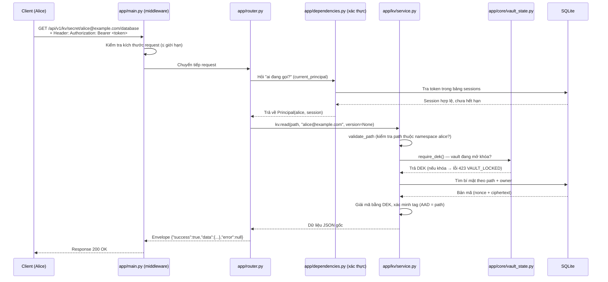

# Báo cáo Project: Mini Vault

> **Môn:** An toàn và Mật mã (Computer Security)
> **Loại project:** Dịch vụ "Két sắt số" (Secure Vault Service) dạng REST API
> **Ngôn ngữ:** Python (FastAPI) — giải thích bằng ngôn ngữ dễ hiểu cho cả sinh viên năm nhất

---

## Mục lục

1. [Project này là gì?](#1-project-này-là-gì)
2. [Kiến trúc tổng quan](#2-kiến-trúc-tổng-quan)
3. [Các thuật ngữ quan trọng (giải thích dễ hiểu)](#3-các-thuật-ngữ-quan-trọng-giải-thích-dễ-hiểu)
4. [Vai trò của từng file](#4-vai-trò-của-từng-file)
5. [Flow tổng thể — một yêu cầu đi qua những đâu?](#5-flow-tổng-thể--một-yêu-cầu-đi-qua-những-đâu)
6. [Flow chi tiết từng tính năng](#6-flow-chi-tiết-từng-tính-năng)
7. [Các quyết định bảo mật quan trọng](#7-các-quyết-định-bảo-mật-quan-trọng)
8. [Kiểm thử (Testing)](#8-kiểm-thử-testing)
9. [Dữ liệu mẫu và demo](#9-dữ-liệu-mẫu-và-demo)
10. [Những gì đã làm được — tóm tắt](#10-những-gì-đã-làm-được--tóm-tắt)

---

## 1. Project này là gì?

**Mini Vault** là một chương trình chạy trên server, cho phép người dùng:

1. **Lưu trữ bí mật (secret)** — ví dụ mật khẩu database, API key... — một cách **an toàn trên ổ đĩa**: dữ liệu được mã hóa trước khi ghi xuống file, nên nếu ai đó "trộm" được file dữ liệu cũng **không đọc được** nội dung.
2. **Mã hóa / giải mã dữ liệu** và **ký số / xác minh chữ ký** cho các ứng dụng khác, mà **không bao giờ đưa khóa cho client**. Giống như dịch vụ AWS KMS hoặc HashiCorp Vault ngoài đời thực.

Điểm cốt lõi về bảo mật: **Khóa dùng để mã hóa (gọi là DEK) không bao giờ được ghi xuống đĩa**. Nó chỉ tồn tại trong bộ nhớ RAM khi server đang "mở khóa" (unlocked).

### Vấn đề mà project giải quyết

- Trong thực tế, nhiều chương trình lưu mật khẩu dạng **chữ thường (plaintext)** hoặc nhúng khóa mã hóa **cứng trong code** → rất nguy hiểm.
- Mini Vault giải quyết 2 bài toán:
  1. **Secure Storage (KV Engine):** Dữ liệu trên đĩa luôn là **bản mã** (ciphertext), chỉ chủ sở hữu mới đọc được.
  2. **Encryption & Signing as a Service (Transit Engine):** Ứng dụng khác cần mã hóa / ký số thì **gửi dữ liệu cho server**, server mã hóa/ký rồi trả kết quả — **khóa không bao giờ rời khỏi server**.

### Công nghệ sử dụng

| Công nghệ | Dùng để làm gì |
|---|---|
| **Python + FastAPI** | Xây dựng REST API |
| **SQLAlchemy + SQLite** | Lưu dữ liệu xuống file database |
| **cryptography** | Mã hóa AES-256-GCM, ký số Ed25519 |
| **argon2-cffi** | Băm mật khẩu và sinh khóa (KDF) |
| **pydantic** | Kiểm tra dữ liệu gửi lên |
| **pytest** | Kiểm thử tự động |
| **Docker** | Đóng gói chạy trong container |

---

## 2. Kiến trúc tổng quan

```text
Client (trình duyệt / ứng dụng)
          │  Gửi HTTP request (REST API)
          ▼
     FastAPI (app/main.py + app/router.py)
          │
   ┌──────┼──────────────────────────────────┐
   ▼      ▼           ▼             ▼         ▼
Auth  Vault Core   KV Engine    Transit     Audit
(đăng   (mở/khóa   (lưu secret  (mã hóa/   (ghi log
 nhập)   két sắt)   đã mã hóa)   ký số)      truy cập)
          │
          ▼
       SQLite (file .db trên đĩa)
```

### Luồng dữ liệu khi mã hóa

```text
Master Passphrase (do người quản trị nhập, KHÔNG lưu)
        │  Argon2id + salt ngẫu nhiên (biến thành khóa)
        ▼
Derived Key (chỉ ở RAM lúc mở khóa)
        │  AES-256-GCM bọc (wrap)
        ▼
Encrypted DEK (lưu trên DB) → DEK thật chỉ ở RAM khi unlock
        │  AES-256-GCM
        ▼
Secret JSON / Named AES key / Khóa ký Ed25519 (đều mã hóa trước khi lưu)
```

**Quy tắc vàng:** Mỗi khi server khởi động lại, nó **luôn ở trạng thái khóa (locked)**. Muốn dùng phải "mở khóa" bằng đúng Master Passphrase.

---

## 3. Các thuật ngữ quan trọng (giải thích dễ hiểu)

| Thuật ngữ | Giải thích đơn giản |
|---|---|
| **Secret** | Một mẩu dữ liệu bí mật, ví dụ `{"password": "abc123"}` |
| **Master Passphrase** | Mật khẩu "chìa khóa chính" do người cài đặt nhập. Như mật khẩu mở két sắt. |
| **DEK (Data Encryption Key)** | Khóa dùng để mã hóa toàn bộ dữ liệu. Như "chìa khóa bên trong két". |
| **Derived Key** | Khóa được **sinh ra từ Master Passphrase** bằng thuật toán Argon2id. Dùng để "bọc" DEK. |
| **Encrypt (mã hóa)** | Biến dữ liệu đọc được thành "đống rác" chỉ đọc được khi có khóa. |
| **Decrypt (giải mã)** | Biến "đống rác" trở lại dữ liệu gốc khi có khóa. |
| **Nonce** | Một số ngẫu nhiên, **mỗi lần mã hóa phải khác nhau**, để an toàn. |
| **GCM / Tag** | AES-GCM tự gắn một "tem chống giả" (tag) vào bản mã. Nếu ai sửa dữ liệu thì tag không khớp → từ chối. |
| **AAD** | "Địa chỉ" đính kèm khi mã hóa (ví dụ đường dẫn). Nếu đổi ngữ cảnh thì giải mã thất bại. |
| **KDF (Key Derivation Function)** | Hàm biến mật khẩu thành khóa, có "thêm muối" (salt) để chống đoán. |
| **Salt** | Một chuỗi ngẫu nhiên trộn vào mật khẩu trước khi băm. |
| **Token / Session** | "Thẻ ra vào" cấp sau khi đăng nhập, có hạn 30 phút. |
| **Ed25519** | Thuật toán **ký số**: tạo cặp khóa (khóa bí mật + khóa công khai). Khóa bí mật ký, khóa công khai kiểm tra. |
| **Envelope (phong bì)** | Định dạng bọc bên ngoài, ví dụ `vault:v1:key:...`, chứa đủ thông tin để giải mã. |

---

## 4. Vai trò của từng file

### 4.1. Các file ở thư mục gốc

| File | Vai trò |
|---|---|
| `main.py` | **Điểm khởi động** của chương trình. Chỉ import `app` từ `app/main.py`. Uvicorn chạy file này: `uvicorn app.main:app` |
| `requirements.txt` | Danh sách thư viện cần cài (`pip install -r requirements.txt`) |
| `pyproject.toml` | Cấu hình cho pytest và ruff (công cụ kiểm tra code) |
| `Dockerfile` | Cách "đóng gói" chương trình vào container (chạy ở bất kỳ máy nào) |
| `docker-compose.yml` | Cách khởi động nhiều container cùng lúc, gắn ổ đĩa ảo `vault-data` |
| `README.md` | Tài liệu hướng dẫn chính của project |
| `Mini_Vault_AI_Context.md` | Bản đặc tả đầy đủ của đề bài (dùng làm tài liệu tham khảo) |

### 4.2. Package `app/` — phần lõi chương trình

#### Lớp "khung" (framework)

| File | Vai trò |
|---|---|
| `app/main.py` | **Tạo ứng dụng FastAPI**, gắn middleware (kiểm tra kích thước request), tạo bảng DB khi khởi động, đảm bảo vault **luôn khóa** lúc bật máy. Có endpoint `/health`. |
| `app/config.py` | **Cấu hình chung**: đường dẫn database, thời gian sống của session (1800 giây = 30 phút), kích thước tối đa request. Đọc từ file `.env` nếu có. |
| `app/database.py` | **Kết nối database**: tạo engine SQLAlchemy, khai báo `Base` (gốc của mọi bảng), tạo `SessionLocal` và hàm `get_db()` (lấy một phiên làm việc với DB). |
| `app/models.py` | **Định nghĩa các bảng** trong database (xem chi tiết ở mục 4.3). |
| `app/schemas.py` | **Định nghĩa khuôn dạng dữ liệu** gửi lên / trả xuống (dùng pydantic để tự kiểm tra). |
| `app/router.py` | **Tuyến đường (routes)**: đây là "bảng chỉ đường" — biết URL nào gọi hàm nào. Mọi API nằm dưới tiền tố `/api/v1`. |
| `app/exceptions.py` | **Quản lý lỗi**: định nghĩa lớp lỗi `AppError` và format chuẩn cho mọi response (envelope `success/data/error`). Bắt lỗi và trả về JSON đẹp. |
| `app/dependencies.py` | **Kiểm tra đăng nhập**: hàm `current_principal` đọc token từ header `Authorization`, kiểm tra token hợp lệ chưa hết hạn, trả về `Principal` (người dùng + phiên đăng nhập). |
| `app/__init__.py` | File đánh dấu thư mục là package Python. |

#### Các bảng dữ liệu (trong `app/models.py`)

| Bảng | Lưu trữ gì |
|---|---|
| `vault_config` | Cấu hình két sắt: salt, tham số KDF, **DEK đã bọc** (encrypted_dek_b64). Không bao giờ lưu DEK thật. |
| `users` | Tài khoản người dùng: email, **băm mật khẩu** (không lưu mật khẩu thật), số lần đăng nhập sai, thời điểm bị khóa. |
| `sessions` | Phiên đăng nhập: **băm của token** (SHA-256), thời gian hết hạn. |
| `kv_secrets` | Bí mật KV: đường dẫn, chủ sở hữu, **bản mã** (nonce + ciphertext). |
| `kv_secret_versions` | **Lịch sử phiên bản** của từng bí mật KV (mỗi lần ghi là một version mới). |
| `transit_keys` | Named key của Transit: tên, chủ sở hữu, loại key, **khóa đã bọc**, khóa công khai (nếu là khóa ký). |
| `transit_key_versions` | Lịch sử phiên bản của named key (phục vụ rotation). |
| `audit_logs` | Nhật ký truy cập: ai, làm gì, trên tài nguyên nào, kết quả, IP. |

#### Module `app/core/` — Phần "két sắt" (Vault Core)

| File | Vai trò |
|---|---|
| `app/core/vault_state.py` | **Trái tim của vault**: giữ DEK thật **chỉ trong RAM**. Có khóa đồng bộ (threading.RLock) để an toàn. Các hàm: `unlock(dek)`, `lock()`, `require_dek()` (nếu khóa thì báo lỗi `VAULT_LOCKED` 423). |
| `app/core/vault_service.py` | **Nghiệp vụ vault**: `init()` (khởi tạo lần đầu — sinh salt, derive khóa, sinh + bọc DEK), `unlock()` (nhập passphrase → giải mã DEK → đưa vào RAM), `status()` (trả về trạng thái). |
| `app/core/key_derivation.py` | **Hàm sinh khóa** từ passphrase bằng Argon2id (KDF) với các tham số mặc định. |
| `app/core/crypto_service.py` | **Hàm mã hóa / giải mã cấp thấp** dùng AES-256-GCM: `encrypt(key, plaintext, aad)` sinh nonce mới mỗi lần; `decrypt(key, nonce, ciphertext, aad)`. |

#### Module `app/auth/` — Đăng nhập / đăng ký

| File | Vai trò |
|---|---|
| `app/auth/service.py` | **Nghiệp vụ xác thực**: `register()` (băm mật khẩu bằng Argon2id), `login()` (kiểm tra mật khẩu, đếm lần sai, **khóa tài khoản 5 phút sau 5 lần sai**, cấp token), `logout()` (thu hồi session). Hàm `token_digest()` băm token bằng SHA-256. |
| `app/auth/schemas.py` | Tái xuất các schema đăng nhập/đăng ký từ `app/schemas.py`. |
| `app/auth/models.py` | Tái xuất bảng `Session`, `User`. |
| `app/auth/repository.py` | File giữ chỗ (ghim ý tưởng kiến trúc: truy vấn DB do Service đảm nhận). |

#### Module `app/kv/` — Feature 1: Lưu trữ bí mật an toàn

| File | Vai trò |
|---|---|
| `app/kv/service.py` | **Nghiệp vụ KV**: `write()` (mã hóa JSON bằng DEK rồi lưu, tạo version mới), `read()` (giải mã, xác minh tag; hỗ trợ đọc version cũ), `versions()` (danh sách version), `delete()` (xóa vĩnh viễn), `list()` (danh sách metadata — không chứa dữ liệu). |
| `app/kv/schemas.py` | Tái xuất schema `KVWriteRequest`. |
| `app/kv/models.py` | Tái xuất bảng `KVSecret`. |
| `app/kv/repository.py` | File giữ chỗ (truy vấn DB do Service đảm nhận). |

#### Module `app/transit/` — Feature 2: Mã hóa & ký số như một dịch vụ

| File | Vai trò |
|---|---|
| `app/transit/service.py` | **Nghiệp vụ Transit**: `create_aes()` (sinh khóa AES ngẫu nhiên, bọc bằng DEK), `create_signing()` (sinh cặp khóa Ed25519, bọc khóa bí mật, lưu khóa công khai), `encrypt()` / `decrypt()` (dùng named key để mã hóa/giải mã dữ liệu, trả ciphertext self-describing), `sign()` / `verify()` (ký / xác minh chữ ký), `rotate()` (xoay khóa sang version mới), `revoke()` (thu hồi khóa). Hàm `_find()` kiểm tra quyền sở hữu và trạng thái khóa. |
| `app/transit/schemas.py` | Tái xuất các schema của Transit. |
| `app/transit/models.py` | Tái xuất bảng `TransitKey`. |
| `app/transit/repository.py` | File giữ chỗ. |

#### Module `app/audit/` — Nhật ký truy cập

| File | Vai trò |
|---|---|
| `app/audit/service.py` | Hàm `audit()` ghi một dòng log: ai (email), hành động, loại tài nguyên, tên tài nguyên, kết quả (ví dụ DENIED), IP. Ghi vào bảng `audit_logs`. |
| `app/audit/models.py` | Tái xuất bảng `AuditLog`. |
| `app/audit/repository.py` | File giữ chỗ (ghi log chỉ thêm mới, không sửa/xóa). |

#### Module `app/middleware/` và `app/utils/`

| File | Vai trò |
|---|---|
| `app/middleware/request_logging.py` | File giữ chỗ, ghi chú: **không bao giờ** log body request hay header Authorization (để bảo mật). |
| `app/utils/base64_utils.py` | Hàm `b64e` (bytes → chuỗi Base64) và `b64d` (chuỗi Base64 → bytes, **kiểm tra nghiêm ngặt**, sai thì báo lỗi). |
| `app/utils/datetime_utils.py` | Hàm `utcnow()` trả về thời gian hiện tại theo chuẩn UTC (tránh lệch múi giờ). |
| `app/utils/validation.py` | **Kiểm tra đầu vào**: `validate_passphrase` (mật khẩu mạnh: ≥12 ký tự, có chữ hoa, thường, số, ký tự đặc biệt), `validate_key_name` (tên key hợp lệ), `validate_path` (đường dẫn hợp lệ, **đúng namespace của chủ sở hữu** — chống vượt thư mục `..`, dấu `\`, ký tự NUL). |

### 4.3. Các thư mục khác

| File / Thư mục | Vai trò |
|---|---|
| `tests/` | Bộ kiểm thử tự động bằng pytest (chi tiết ở mục 8). |
| `tests/conftest.py` | Thiết lập chung cho test: dùng DB riêng, reset dữ liệu giữa các test, tạo `client` giả để gọi API, hàm `register_login` tiện lợi. |
| `scripts/make_samples.py` | Tạo dữ liệu mẫu nộp kèm (mục 9) bằng chính ứng dụng thật. |
| `scripts/demo_full.sh` | Chạy demo toàn bộ 8 mục yêu cầu, in ra từng request/response để quay video / chụp screenshot. |
| `scripts/package.sh` | Đóng gói project thành file `.zip` đúng quy định nộp bài. |
| `docs/api-demo.http` | Các request HTTP mẫu chạy tuần tự cho demo (dùng trong extension REST Client). |
| `docs/report/` | Thư mục chứa báo cáo PDF chính thức + screenshot demo. |
| `data/samples/` | Dữ liệu mẫu: file DB đã mã hóa, ciphertext mẫu, bộ round-trip. |
| `data/logs/` | Audit log mẫu (gồm 2 truy cập chéo bị từ chối). |

---

## 5. Flow tổng thể — một yêu cầu đi qua những đâu?

Lấy ví dụ: người dùng Alice muốn **đọc** bí mật `secret/alice@example.com/database`.



**Thứ tự kiểm tra rất quan trọng** (giống "cửa ra vào nhiều lớp"):
1. **Middleware** kiểm tra kích thước request.
2. **Xác thực (auth)** kiểm tra token → sai thì trả `UNAUTHENTICATED` (401) ngay, chưa cần biết đường dẫn.
3. **Quyền sở hữu (ownership)** kiểm tra path có thuộc về người gọi không → sai trả `PERMISSION_DENIED` (403) mà **không tiết lộ** đường dẫn đó có tồn tại hay không.
4. **Trạng thái vault** — phải mở khóa mới được đụng vào dữ liệu.
5. **Mã hóa/giải mã** mới được thực hiện.

---

## 6. Flow chi tiết từng tính năng

### Feature 0.1 — Khởi tạo và mở khóa vault (Master Passphrase)

**Mục tiêu:** Người quản trị đặt một Master Passphrase. Máy phải "mở khóa" đúng passphrase đó mỗi lần khởi động.

**Flow `POST /api/v1/vault/init`** (lần đầu tiên):
1. Kiểm tra vault **chưa được khởi tạo** (nếu đã có → lỗi 409 `VAULT_ALREADY_INITIALIZED`).
2. Kiểm tra 2 lần nhập passphrase **giống nhau**, và passphrase **đủ mạnh**.
3. Sinh **salt ngẫu nhiên** (16 byte) và **DEK ngẫu nhiên** (32 byte).
4. Dùng Argon2id biến passphrase + salt thành **Derived Key**.
5. Dùng Derived Key **bọc (encrypt) DEK** bằng AES-256-GCM (AAD = `mini-vault-dek-v1`).
6. Lưu salt, tham số KDF, DEK đã bọc, nonce vào bảng `vault_config`. **DEK thật không lưu**.
7. Vault vẫn ở trạng thái **locked**. Trả về `{"initialized": true, "status": "locked"}`.

**Flow `POST /api/v1/vault/unlock`**:
1. Lấy salt + tham số từ DB, derive lại khóa từ passphrase người dùng nhập.
2. Thử **giải mã** DEK đã bọc.
   - Sai passphrase → AES-GCM **tag không khớp** → bắt lỗi, trả `INVALID_MASTER_PASSPHRASE` (401) — **không nói rõ chi tiết** để không lộ thông tin.
   - Đúng → đưa DEK vào `vault_state` (RAM). Trạng thái = `unlocked`.

**Flow `POST /api/v1/vault/lock`**:
- Gọi `vault_state.lock()` → xóa DEK khỏi RAM. Từ giờ mọi thao tác KV/Transit trả `VAULT_LOCKED` (423).

**Flow `GET /api/v1/vault/status`**:
- Trả về `initialized` (đã khởi tạo chưa) và `status` (locked/unlocked). **Không chứa bất kỳ khóa nào.**

> 💡 **So sánh dễ hiểu:** Vault giống một két sắt. `init` = đặt mật khẩu cho két và cất "chìa khóa trong" (DEK) được bọc lại. `unlock` = nhập mật khẩu để lấy chìa khóa trong ra (chỉ giữ trên tay = RAM). `lock` = vứt chìa khóa đi.

---

### Feature 0.2 — Đăng ký, đăng nhập, hết hạn session, khóa tài khoản

**Mục tiêu:** Biết chính xác ai đang dùng hệ thống; chặn kẻ đoán mật khẩu.

**Flow `POST /api/v1/auth/register`**:
1. Chuẩn hóa email (viết thường, bỏ khoảng trắng).
2. Kiểm tra 2 lần nhập passphrase giống nhau + passphrase đủ mạnh.
3. Kiểm tra email **chưa tồn tại** (nếu có → 409 `EMAIL_ALREADY_EXISTS`).
4. **Băm mật khẩu bằng Argon2id** (không bao giờ lưu mật khẩu thật, không dùng SHA thường).
5. Lưu vào bảng `users`. Trả về email.

**Flow `POST /api/v1/auth/login`**:
1. Tìm user theo email.
2. Nếu user đang **bị khóa** (locked_until > hiện tại) → trả `ACCOUNT_LOCKED` (423) dù mật khẩu đúng.
3. Nếu hết thời gian khóa → **đặt lại bộ đếm** (cần 5 lần sai liên tiếp mới khóa lại).
4. Kiểm tra mật khẩu bằng Argon2id (`hasher.verify`).
   - Sai → tăng biến đếm; đủ 5 lần → `locked_until = now + 5 phút`. Trả `INVALID_CREDENTIALS` (401).
   - Đúng → reset bộ đếm, **sinh token ngẫu nhiên** (`secrets.token_urlsafe(32)` — 256 bit entropy).
5. Lưu **băm SHA-256 của token** (không lưu token thật) + thời gian hết hạn (30 phút) vào bảng `sessions`.
6. Trả token cho client.

**Flow `POST /api/v1/auth/logout`**:
- Đánh dấu session bị thu hồi (`revoked_at`). Token không dùng được nữa.

**Flow `GET /api/v1/auth/me`**:
- Trả email của người đang đăng nhập (cần token hợp lệ).

> 🔒 **Bảo mật:** Token 256 bit ngẫu nhiên rất khó đoán; DB chỉ lưu băm SHA-256 nên nếu DB bị lộ thì token cũng không đọc lại được. So sánh token dùng `compare_digest` để chống tấn công timing.

---

### Feature 1.1 — KV Engine: ghi / đọc / xóa bí mật đã mã hóa

**Mục tiêu:** Dữ liệu trên đĩa **luôn là bản mã**; sửa 1 byte trên đĩa → đọc phải thất bại.

**Flow `PUT /api/v1/kv/{path}` (ghi)**:
1. `validate_path` kiểm tra path hợp lệ và thuộc namespace của người gọi.
2. Lấy DEK từ `vault_state` (nếu khóa → 423).
3. Chuyển JSON thành bytes, kiểm tra kích thước ≤ ~1 MiB.
4. **Mã hóa AES-256-GCM** với DEK, **nonce mới mỗi lần**, AAD = chính path.
5. Nếu path đã tồn tại: cập nhật bản mã, tạo **version mới** (tăng số). Nếu chưa: tạo bản ghi mới (version 1).
6. Lưu vào bảng `kv_secrets` + `kv_secret_versions`. Trả version + thời gian.

**Flow `GET /api/v1/kv/{path}` (đọc)**:
1. Kiểm tra quyền sở hữu (path phải thuộc namespace).
2. Tìm bản ghi; nếu không có → 404 `NOT_FOUND` (không trả dữ liệu "rác").
3. Giải mã, xác minh tag (AAD = path). **Tag không khớp (bị sửa)** → 400 `DECRYPTION_FAILED`, **không bao giờ trả dữ liệu sai**.
4. Trả JSON gốc. Hỗ trợ `?version=N` để đọc **snapshot cũ**.

**Flow `GET /api/v1/kv-versions/{path}`**:
- Trả danh sách `{version, created_at}` — **không chứa dữ liệu** (không lộ plaintext).

**Flow `DELETE /api/v1/kv/{path}`**:
- Kiểm tra quyền sở hữu → xóa bản ghi **và toàn bộ lịch sử version**. Xóa vĩnh viễn.

**Flow `GET /api/v1/kv`**:
- Danh sách metadata (path, version, thời gian) của chủ sở hữu — không chứa giá trị.

> 💡 **Chống sửa dữ liệu:** AES-GCM gắn "tem" (tag) vào bản mã. Test đã chứng minh: đổi **1 byte** trong ciphertext hoặc tag trên đĩa → `read` trả `DECRYPTION_FAILED` 100%.

---

### Feature 1.2 — Kiểm soát truy cập theo quyền sở hữu (KV)

**Mục tiêu:** Alice không thể đọc/ghi/xóa bí mật của Bob dù **đoán đúng đường dẫn**.

**Cơ chế:**
- Mọi secret có path dạng `secret/<email>/...` — email chính là "không gian" (namespace) của chủ sở hữu.
- `validate_path` yêu cầu path **bắt đầu đúng bằng** `secret/<email_của_người_gọi>/`.
- Nếu không khớp → trả `PERMISSION_DENIED` (403) **trước khi** chạy bất kỳ thao tác mã hóa/giải mã nào.
- Lỗi trả về **giống nhau** cho cả "path không tồn tại" và "không có quyền" → kẻ tấn công không đoán được path nào đang tồn tại.
- Mọi lần bị từ chối đều được **ghi vào audit log** (ai, path nào, DENIED).

---

### Feature 2.1 — Quản lý Named Key (khóa có tên)

**Mục tiêu:** Tạo khóa riêng cho từng mục đích, khóa **không bao giờ rời server**.

**Flow `POST /api/v1/transit/keys` (tạo AES key)**:
1. Kiểm tra tên key hợp lệ + vault mở khóa.
2. Nếu **trùng tên** (cùng chủ sở hữu) → 409 `KEY_ALREADY_EXISTS` (nhóm chọn *từ chối*, không ghi đè).
3. Sinh khóa AES ngẫu nhiên 32 byte → **bọc bằng DEK** (AAD = `key:<email>:<name>`).
4. Lưu vào `transit_keys` với `key_usage = ENCRYPT_DECRYPT` + tạo version 1 trong `transit_key_versions`.
5. Trả về **metadata** (tên, loại, thuật toán, version) — **không bao giờ trả khóa thật**.

**Flow `POST /api/v1/transit/signing-keys` (tạo khóa ký Ed25519)**:
1. Tương tự, nhưng sinh **cặp khóa Ed25519**.
2. **Khóa bí mật được bọc bằng DEK** trước khi lưu; **khóa công khai** lưu dạng thường (không phải bí mật).
3. `key_usage = SIGN_VERIFY`, `algorithm = ED25519`.

**Flow `GET /api/v1/transit/keys`**:
- Danh sách metadata của chủ sở hữu — **không chứa key material**.

**Flow `POST /api/v1/transit/keys/{name}/rotate`**:
- Chỉ áp dụng cho key `ENCRYPT_DECRYPT`. Sinh khóa mới, tăng version, lưu version cũ vẫn còn. Ciphertext cũ (`vault:v1:...`) **vẫn giải mã được** cho tới khi key bị thu hồi.

**Flow `DELETE /api/v1/transit/keys/{name}`**:
- **Soft revoke**: đặt `revoked_at`. Mọi thao tác crypto/metadata sau đó đều từ chối.

---

### Feature 2.2 — Mã hóa / giải mã như một dịch vụ (Transit)

**Mục tiêu:** Client gửi dữ liệu, server trả bản mã — client **không cần giữ khóa**.

**Flow `POST /api/v1/transit/encrypt`**:
1. Kiểm tra quyền sở hữu named key + key chưa bị thu hồi + đúng loại `ENCRYPT_DECRYPT`.
2. Giải mã khóa AES (từ DEK) **tạm thời trong RAM**.
3. Mã hóa dữ liệu bằng AES-256-GCM, nonce mới, AAD gắn version + owner + key name.
4. Trả về **ciphertext tự mô tả** (self-describing):
   ```
   vault:v<version>:<key_name>:<base64(nonce || ciphertext || tag)>
   ```

**Flow `POST /api/v1/transit/decrypt`**:
1. Tách chuỗi ciphertext ra các phần (`vault` / version / key_name / blob).
2. Nếu định dạng sai, blob quá ngắn → 400 `INVALID_CIPHERTEXT`.
3. Kiểm tra quyền sở hữu của `key_name` đọc được từ ciphertext.
4. Lấy khóa đúng **version** từ lịch sử, giải mã + xác minh tag.
5. Tag sai (dữ liệu bị sửa) → 400 `DECRYPTION_FAILED`; đúng → trả plaintext (Base64).

> 💡 **Tại sao gọi là "self-describing"?** Vì bản thân chuỗi ciphertext đã chứa tên khóa và version — client không cần nhớ đã dùng khóa nào.

---

### Feature 2.3 — Kiểm soát truy cập Named Key (Transit)

**Mục tiêu:** Bob không thể dùng khóa của Alice dù biết chính xác tên khóa.

**Cơ chế:**
- Hàm `_find()` trong `app/transit/service.py` tìm key theo `(owner_email, key_name)`.
- Nếu không tìm thấy trong namespace của người gọi → trả `PERMISSION_DENIED` (403) — **giống hệt** trường hợp "không tồn tại" để không lộ tên khóa (bug #1 đã được sửa, có test hồi quy).
- Kiểm tra quyền **trước khi** thực hiện bất kỳ thao tác mã hóa nào.
- Lần từ chối được ghi audit log (bug được chốt bằng test: đếm audit rows).

---

### Feature 2.4 — Ký số & xác minh chữ ký

**Mục tiêu:** Ký tài liệu mà **khóa bí mật không rời server**; phát hiện tài liệu bị sửa hoặc chữ ký sai.

**Flow `POST /api/v1/transit/sign`**:
1. Kiểm tra quyền sở hữu + key loại `SIGN_VERIFY`.
2. Giải mã khóa bí mật Ed25519 từ DEK (tạm thời).
3. Với `message_type = DIGEST`: yêu cầu message **đúng 32 byte** (là SHA-256 digest do client tự tính) → ký 32 byte đó.
4. Với `message_type = RAW`: ký thẳng message gốc (Ed25519 tự hash nội bộ bằng SHA-512).
5. Trả `signature_b64`.

**Flow `POST /api/v1/transit/verify`**:
1. Kiểm tra quyền sở hữu + `signing_algorithm` (nếu gửi lên mà không khớp thuật toán của key → 400 `INVALID_SIGNING_ALGORITHM`).
2. Dùng **khóa công khai** (lưu trong DB) để xác minh chữ ký.
3. Trả kết quả **có cấu trúc**: `{"signature_valid": true/false}`.
   - Message bị sửa, chữ ký sai, hoặc dùng khóa khác → `signature_valid: false` (không ném exception, không lộ khóa bí mật).

> 🔒 **Điểm mấu chốt:** Dù `verify` công khai cần khóa công khai, trong project này chỉ **chủ sở hữu** mới được gọi `verify()` (đúng theo phạm vi bắt buộc của đề).

---

## 7. Các quyết định bảo mật quan trọng

| # | Quyết định | Lý do |
|---|---|---|
| 1 | Dùng **Argon2id** cho KDF và băm mật khẩu | Memory-hard: chống brute-force bằng GPU; băm một chiều cho mật khẩu, mã hóa có khóa cho dữ liệu |
| 2 | Mã hóa bằng **AES-256-GCM** | Vừa **bí mật** (confidentiality) vừa **toàn vẹn** (integrity) nhờ tag |
| 3 | **Nonce mới mỗi lần mã hóa** | Tái sử dụng nonce với cùng khóa GCM có thể làm lộ dữ liệu |
| 4 | **DEK, derived key, Master Passphrase không bao giờ lưu/log** | Chỉ ở RAM lúc unlock |
| 5 | Khóa bí mật ký **bọc bằng DEK** trước khi lưu; khóa công khai lưu thường | Khóa công khai không bí mật nên không cần mã hóa |
| 6 | **Auth trước, authorization trước, rồi mới crypto** | Access trái phép không bao giờ chạm tới dữ liệu |
| 7 | Token 256 bit, DB chỉ lưu **SHA-256 digest**, so sánh bằng `compare_digest` | Chống lộ token nếu DB bị đánh cắp; chống tấn công timing |
| 8 | **Khóa tài khoản 5 phút sau 5 lần sai liên tiếp** | Chống đoán mật khẩu |
| 9 | Base64 decode **nghiêm ngặt**; key name / path dùng **whitelist**; chặn `..`, `\`, NUL, namespace khác | Chống tấn công path traversal / injection |
| 10 | Giới hạn payload ~1 MiB | Chống tấn công làm đầy bộ nhớ |
| 11 | Ciphertext Transit **self-describing** (`vault:vN:name:...`) | Client không cần nhớ khóa đã dùng; thêm version để hỗ trợ rotation |
| 12 | Lỗi "không tồn tại" và "không có quyền" **giống hệt nhau** | Không rò rỉ thông tin về tài nguyên |

---

## 8. Kiểm thử (Testing)

Project có **15 test pytest** phủ cả 8 mục bắt buộc, chạy bằng:
```bash
pytest -v
ruff check app tests   # kiểm tra chất lượng code
```

| File test | Nội dung chính |
|---|---|
| `tests/conftest.py` | Thiết lập chung: DB riêng `test-mini-vault.db`, reset schema mỗi test, client giả, hàm `register_login` |
| `tests/test_vault.py` | Init/unlock/lock; passphrase sai; **DEK không nằm trên đĩa**; trạng thái luôn locked khi khởi động |
| `tests/test_auth.py` | Register/login/logout; email trùng; **khóa tài khoản 5 phút**; hết hạn token; đếm lần sai được reset sau khi hết khóa |
| `tests/test_kv.py` | CRUD round-trip; **tamper 1 byte ciphertext/tag → từ chối**; Bob đọc của Alice → 403; versioning; thứ tự auth trước vault |
| `tests/test_transit.py` | Encrypt/decrypt round-trip (text, JSON, binary, **rỗng**); access control; tamper ciphertext; sign/verify; message sửa → `signature_valid: false`; rotation; key không lộ; khóa sai loại → `INVALID_KEY_USAGE` |

Các **bug đã được tìm và sửa** (có test hồi quy):
- **Bug #1:** Key của người khác và key không tồn tại từng trả lỗi khác nhau → rò rỉ tên khóa. Đã sửa: cả hai đều trả `PERMISSION_DENIED` giống nhau.
- **Bug #2:** Plaintext rỗng từng bị coi là ciphertext hỏng. Đã sửa: cho phép blob 28 byte (12 nonce + 16 tag) giải mã về rỗng.

---

## 9. Dữ liệu mẫu và demo

### Dữ liệu mẫu (`data/samples/` và `data/logs/`)

Sinh bằng chính ứng dụng thật (không giả lập mật mã) qua:
```bash
python scripts/make_samples.py
```

| File | Nội dung |
|---|---|
| `data/samples/sample_vault.db` | File DB **đã mã hóa**: vault config, user, KV secret, named key, audit log |
| `data/samples/transit_ciphertext.txt` | Một ciphertext Transit mẫu (`vault:v1:payment-key:...`) |
| `data/samples/transit_samples.json` | Bộ round-trip đầy đủ: plaintext/ciphertext + message/signature |
| `data/logs/audit_log_sample.txt` | Audit log mẫu, gồm **2 truy cập chéo bị DENIED** (Bob đọc KV của Alice, Bob encrypt bằng key của Alice) |

Script **tự kiểm chứng**: không một plaintext nào (mật khẩu, passphrase, message) xuất hiện trong file DB — chứng minh "encrypted at rest".

### Demo

- **`docs/api-demo.http`** — chuỗi request chạy tuần tự (dùng REST Client trong VS Code).
- **`scripts/demo_full.sh`** — chạy demo toàn bộ 8 mục, in từng request/response (dùng để quay video hoặc chụp screenshot vào báo cáo PDF).
- **`docs/report/screenshots/`** — 10 screenshot demo tương ứng 8 mục bắt buộc.
- **Video demo:** đường dẫn trong `README.md` (đặt theo mục VII của đề).

---

## 10. Những gì đã làm được — tóm tắt

✅ **Feature 0.1** — Vault init/unlock với Master Passphrase, Argon2id KDF, DEK bọc AES-256-GCM, luôn locked khi khởi động, DEK chỉ ở RAM.

✅ **Feature 0.2** — Register/login, băm mật khẩu Argon2id, session token 30 phút (DB chỉ lưu SHA-256 digest), khóa tài khoản 5 phút sau 5 lần sai.

✅ **Feature 1.1** — KV Engine: ghi/đọc/xóa secret **mã hóa AES-256-GCM**, nonce mới mỗi lần, AAD = path, chống tamper 1 byte, có **versioning** (mở rộng so với đề).

✅ **Feature 1.2** — Kiểm soát quyền sở hữu theo namespace `secret/<email>/`, lỗi không tiết lộ thông tin, ghi audit log khi từ chối.

✅ **Feature 2.1** — Named key AES/Ed25519, khóa bọc bằng DEK, key material **không bao giờ** trả ra API, trùng tên → `KEY_ALREADY_EXISTS`, hỗ trợ **rotation** và **revoke**.

✅ **Feature 2.2** — Encrypt/decrypt như một dịch vụ với ciphertext self-describing; định dạng sai, tamper → từ chối 100%; kiểm tra đúng loại key.

✅ **Feature 2.3** — Kiểm soát quyền sở hữu named key; "không tồn tại" và "không có quyền" không thể phân biệt.

✅ **Feature 2.4** — Sign/verify Ed25519; `message_type` RAW/DIGEST; verify trả `signature_valid` (không ném exception); kiểm tra `signing_algorithm`.

✅ **Bảo mật bổ sung** — Audit log, giới hạn kích thước request, whitelist path/key name, base64 nghiêm ngặt, envelope response chuẩn, middleware không log dữ liệu nhạy cảm.

✅ **Chất lượng** — 15 test pytest + ruff sạch, dữ liệu mẫu tự sinh và tự kiểm chứng, demo script + screenshot, đóng gói `scripts/package.sh`, chạy được bằng Docker.

---

*Báo cáo này được tạo tự động từ việc phân tích toàn bộ mã nguồn của project Mini Vault, nhằm giúp mọi thành viên (kể cả sinh viên năm nhất) nắm được kiến trúc, vai trò từng file và luồng hoạt động của hệ thống.*
